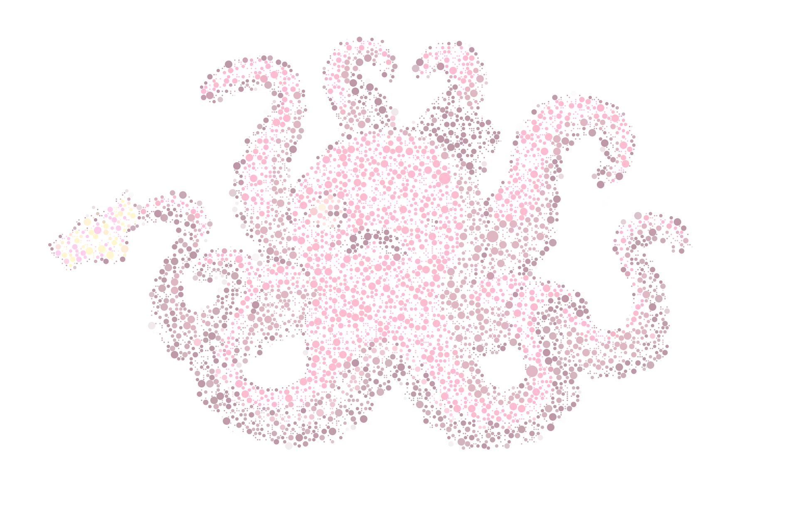

# rspt - Pointillism



This experiment is based on [Processing](https://processing.org)

## Play with it!

Download the repo and open the `pde` file:

```
git clone git@github.com:rspt/processing-pointillism.git pointillism
cd pointillism/pointillism
open pointillism.pde
```

Then simply click run!

If you want to change the image, put it in the `pointillism/images/base` folder and change the name of the image, the width and the height of the canvas to match your image!

## Save it!

This sketch automatically save the image when done. You can found it in `pointillism/images/export`

## License

<a rel="license" href="http://creativecommons.org/licenses/by/4.0/"></a><br /><span xmlns:dct="http://purl.org/dc/terms/" property="dct:title">Pointillism</span> by <a xmlns:cc="http://creativecommons.org/ns#" href="https://rspt.io" property="cc:attributionName" rel="cc:attributionURL">rspt</a> is licensed under a <a rel="license" href="http://creativecommons.org/licenses/by/4.0/">Creative Commons Attribution 4.0 International License</a>.<br />Based on a work at <a xmlns:dct="http://purl.org/dc/terms/" href="git@github.com:rspt/processing-pointillism.git" rel="dct:source">git@github.com:rspt/processing-pointillism.git</a>.
